# Meal-Delivery Pricing & Promotion Strategy

> **For Recruiters — 30-Second Summary**
> - **Role target:** Data Analyst · Business Analyst · Pricing Analyst · Commercial Analyst
> - **Tools:** Python (pandas, numpy, matplotlib) · SQL · Tableau dashboard *(in progress)*
> - **Business question:** Should this meal-delivery company apply the same discount and promotion strategy across all product categories — or does it need to differ by category?
> - **What I found:** Price sensitivity varies ~19x across categories, promotion channels overlap rather than stack additively, price sensitivity and promo responsiveness are unrelated, and two categories are currently being discounted backwards relative to their own price sensitivity.
> - **What I built:** A verified pricing/promotion playbook (every claim backed by a chart), a decision matrix for category-level strategy, and a proposed A/B test to validate the highest-value recommendation before rollout.
> - **Full case study below** ↓ — or jump to [SQL queries](/sql), [data dictionary](data_dictionary.md), [methodology appendix](methodology_appendix.md).

---

**Data source:** Genpact meal-delivery demand dataset (real operational data from a meal-delivery company operating across multiple cities) — 456,548 weekly records, 145 weeks, 77 fulfilment centers, 51 meals across 14 categories and 4 cuisines.

**What this is:** A pricing and promotion analysis built from real transaction-level data, verified end-to-end — every number in this report is traceable to a table or chart, every claim was checked against the full dataset before being written down, and every finding states plainly what it can and cannot prove.

**What this is not:** A machine-learning demand-forecasting exercise (the dataset was originally released for that purpose). This report instead asks a business question: *how should this company price and promote its products differently across categories, and what would it take to prove that a change actually works?*

---

## TL;DR

| Finding | What we found | What it's worth |
|---|---|---|
| 1. Category price elasticity | Elasticity ranges from -3.84 (Seafood) to -0.20 (Extras) across categories — a ~19x spread. Verified against real revenue: deep discounts grow revenue for elastic categories, shrink it for inelastic ones. | Category-level pricing playbook |
| 2. Promotion channels stack with diminishing returns | Using both promo channels together delivers 2.66x lift — 30% below the 3.80x you'd expect if the two channels were independent. | Promo budget allocation |
| 3. Price sensitivity ≠ promo responsiveness | Correlation between a category's price elasticity and its promo lift is 0.08 — essentially zero. | Don't use one lever to predict the other |
| 4. Category averages can mislead | Beverages (12 products) span elasticity from -3.39 to -0.99. Current discounting is backwards: the price-sensitive tier gets *less* discount, not more. | Product-level pricing override for 2 categories |

Everything below is revenue-based (checkout_price × num_orders), not profit — the dataset has no cost data, so no claim in this report is about margin or profitability. That boundary is repeated throughout because it matters.

---

## Business Context

The company operates 77 fulfilment centers selling 51 meals across 14 categories. `checkout_price` (actual price charged) frequently differs from `base_price` (list price) — 50% of all rows carry an active discount, 25% show a price increase, and the rest are unchanged. Two independent promotion channels exist: an email campaign (`emailer_for_promotion`) and homepage featuring (`homepage_featured`), each used on roughly 4-11% of rows. This gives real, price-varying, promotion-varying data to work with — not a synthetic or single-snapshot dataset.

---

## Finding 1: Price Elasticity Varies Sharply by Category — and the Revenue Impact Is Real, Not Theoretical

### 1.1 The Elasticity Spread

Price elasticity measures how much demand moves when price moves. Concretely, in our data: Seafood has an elasticity of -3.84, meaning a 1% price increase corresponds to roughly a 3.84% drop in orders for that category — a coefficient near 0 means price barely matters, and a large negative number means demand is highly sensitive to price. We estimated this per meal×center pair (log-log slope of price vs. orders, using pairs with ≥10 distinct price points and ≥20 observations — 3,534 pairs qualified), then aggregated to category level.

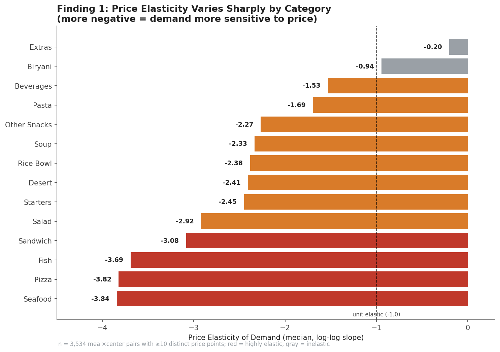

96.9% of the 3,534 pairs showed the expected negative sign (price up → demand down), which is itself a sanity check that the estimates are behaviorally sensible rather than noise. Categories split clearly: Seafood and Pizza are highly elastic (below -3.5); Extras and Biryani are essentially price-insensitive (above -0.95). These four are used as the comparison set below because they sit at the two extremes and their revenue behavior can be directly contrasted.

### 1.2 Revenue Validation

**This isn't just a coefficient — we checked whether it actually shows up in revenue.** For four categories spanning the range, we plotted average revenue per row against discount depth:

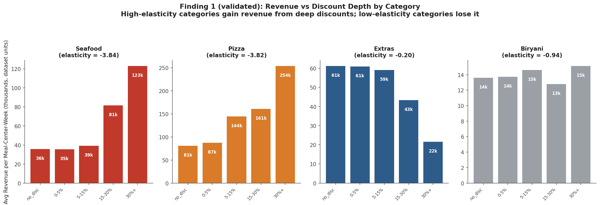

- **Seafood** (elasticity -3.84): revenue rises from $36k (no discount) to $123k (30%+ discount) — a 3.4x increase.
- **Pizza** (elasticity -3.82): $81k → $254k, same monotonic pattern.
- **Extras** (elasticity -0.20): revenue *falls* from $61k to $22k as discount deepens — a 65% loss.
- **Biryani** (elasticity -0.94, close to unit-elastic): revenue stays roughly flat ($14k → $15k) across all discount depths — which is exactly what textbook elasticity theory predicts happens near a coefficient of -1 (price and quantity changes roughly cancel out). This wasn't cherry-picked; it's a natural confirmation that the coefficient and the revenue curve agree.

### 1.3 Ruling Out Confounds

**What this rules out:** before trusting these elasticity numbers, we checked for two things that could have secretly been driving the pattern instead of the product itself — and instead of just asserting the check passed, here's what it actually looked like.

*Could it just be which centers happen to sell each category?* If, say, Seafood happened to be sold mostly by unusually large or unusually cheap-to-run centers, that could explain its high elasticity instead of the product itself.

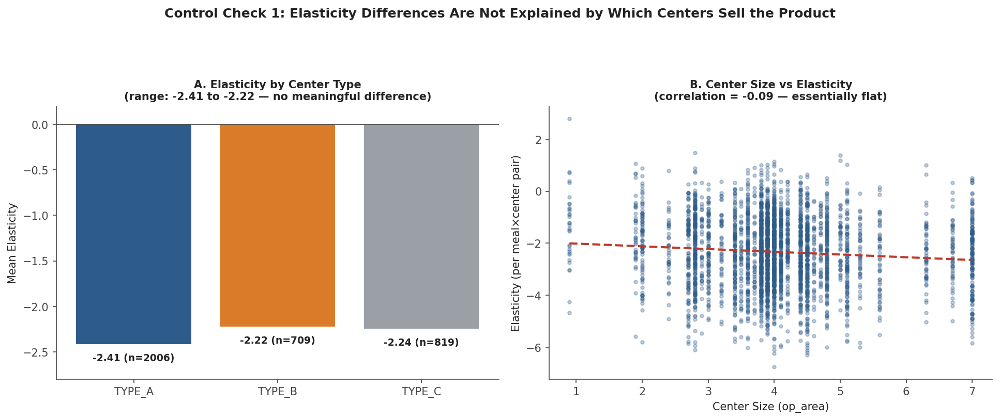

Panel A shows elasticity barely moves across center type (TYPE_A/B/C: -2.41, -2.22, -2.24 — a narrow range, each backed by hundreds to thousands of pairs). Panel B plots all 3,534 meal×center pairs against center size directly — the trend line is nearly flat (correlation -0.09). So it's not the centers — it's the product.

*Could discounts have just happened to cluster in slow or busy weeks, making the pattern a timing artifact rather than a real price effect?*

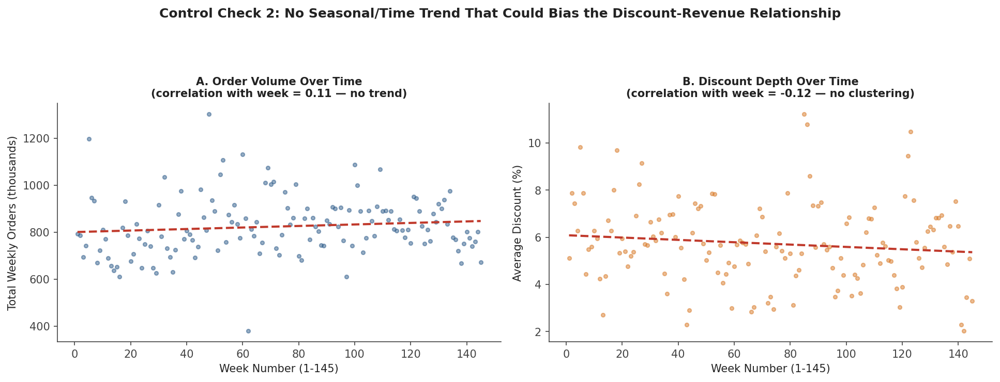

Panel A plots total weekly orders against week number across all 145 weeks — no upward or downward drift (correlation 0.11). Panel B does the same for average discount depth — also flat (correlation -0.12). Discounts weren't concentrated in any particular period, so the revenue pattern isn't an artifact of when discounts happened to be applied.

Both checks came back clean. That doesn't make the elasticity estimates causal — price wasn't randomly assigned, so factors we didn't test for could still be at play — but it does rule out the two most obvious alternative explanations (which centers sell the product, and when discounts happened to occur), which makes "the product itself" a more credible driver of the pattern than it would be without these checks.

### 1.4 What This Means for Pricing

**What this means for pricing:** discount depth should be set by category elasticity, not applied uniformly across the board.

For Seafood and Pizza — both highly elastic at -3.84 and -3.82 respectively — a deep discount is a real revenue lever, not just a volume play: pushing from no discount to 30%+ roughly tripled average revenue per row in both categories ($36k→$123k for Seafood, $81k→$254k for Pizza). The order volume increase is large enough to outweigh the lower price per order.

For Extras (elasticity -0.20, barely price-sensitive at all), the opposite is true: the exact same 30%+ discount depth cut average revenue per row by nearly two-thirds ($61k→$22k). Orders barely moved, so all that happened was the price got cut with almost nothing gained in return. Biryani (elasticity -0.94, close to unit-elastic at -1) sits in between, and its revenue stayed roughly flat regardless of discount depth ($14k-$15k across all bins) — for a category like this, discounting is close to a wash: it doesn't clearly help or hurt, so it's not a lever worth spending promotional effort on.

To be clear about what's actually doing the explanatory work here: Seafood, Pizza, Extras, and Biryani aren't special in themselves — they're simply four categories that happen to sit at the extremes and middle of the elasticity spectrum from Chart 1. The pattern being demonstrated is that elasticity predicts the revenue outcome, not that these four products have some unique property. Any other category could be swapped in at a similar elasticity level and the same relationship should hold.

The practical takeaway: before setting a discount depth for any category, check which side of this line it falls on. Categories like Seafood/Pizza reward aggressive discounting; categories like Extras are actively harmed by it; and unit-elastic categories like Biryani are largely indifferent, so effort is better spent elsewhere.

---

## Finding 2: Promotion Channels Show Diminishing Returns When Stacked

### 2.1 Promotion Lift by Channel

Emailer and homepage promotion are frequently bundled with discounts, which makes their effect hard to isolate — so we controlled for this by only looking at rows with ≤5% discount, where price is roughly held constant.

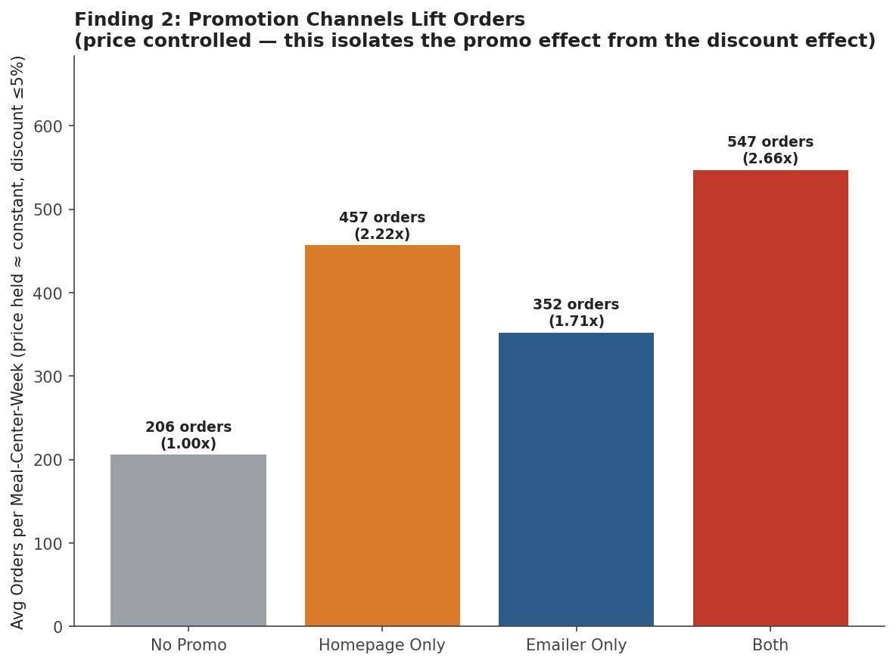

With price effectively controlled: homepage alone delivers 2.22x lift, emailer alone delivers 1.71x, and using both together delivers 2.66x — clearly positive, but **not** the 3.80x you'd get if the two channels' effects were independent and multiplicative.

### 2.2 Diminishing Returns When Stacked

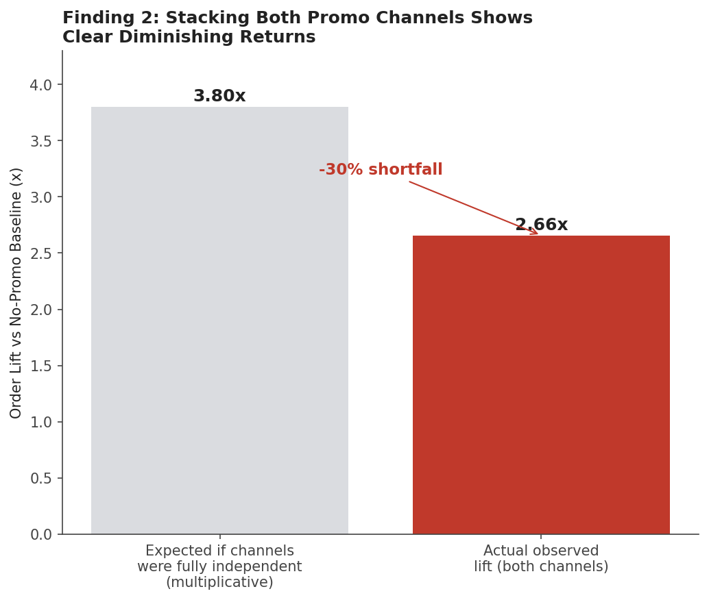

The combined effect falls 30% short of what independence would predict. The two channels likely reach overlapping audiences rather than fully additive ones.

**What this means for budget:** homepage is the stronger single channel. Running both simultaneously is not wasted money, but it should not be budgeted as if the two effects simply add up — the marginal value of adding the second channel is meaningfully lower than the value of the first.

*Caveat:* the "both channels" group (1,042 rows) is the smallest of the four combinations, so this estimate has more noise than the single-channel estimates. Directionally reliable; precise multiplier less so.

---

## Finding 3: Price Sensitivity and Promotion Responsiveness Are Two Independent Dimensions

Finding 1 established that categories differ sharply in price elasticity. Finding 2 established that promotion channels lift orders independent of price. That raises an obvious question before treating pricing and promotion as two separate levers in the Recommendations section: **are they actually separate, or is "promotion-responsive" just another name for "price-sensitive"?** If a category's promo lift could be predicted from its elasticity, we wouldn't need to analyze the two things separately — one number would tell you both. So we checked directly, without assuming the answer either way going in.

### 3.1 How Promotion Lift Is Measured

**How "promotion lift" is calculated:** same price-controlled approach as Finding 2 — we restrict to rows with ≤5% discount so price is held roughly flat, which isolates the promotion channel's own effect from the separate effect of discounting (the two are normally bundled together, as Finding 2 showed). The metric here is **order count, not revenue** — promotion doesn't change price, it changes how many people show up to order, so order volume is the direct thing to measure; mixing in revenue would blend the promotion effect together with any price effect, which is exactly what this control is meant to avoid.

The chart below is a **worked example with 2 categories only**, showing the calculation step by step (bar height → the divide arrow → the resulting multiplier). These two aren't arbitrary picks — **Seafood is the single most price-elastic category in the entire dataset (-3.84), and Beverages is the single highest promo-lift category in the entire dataset (2.63x)**. Pairing the two axis-extremes together is the clearest way to show the mismatch: if price sensitivity predicted promo responsiveness, these two "record holders" should be the same category — they aren't. The full result across all 14 categories is in the scatter plot further down.

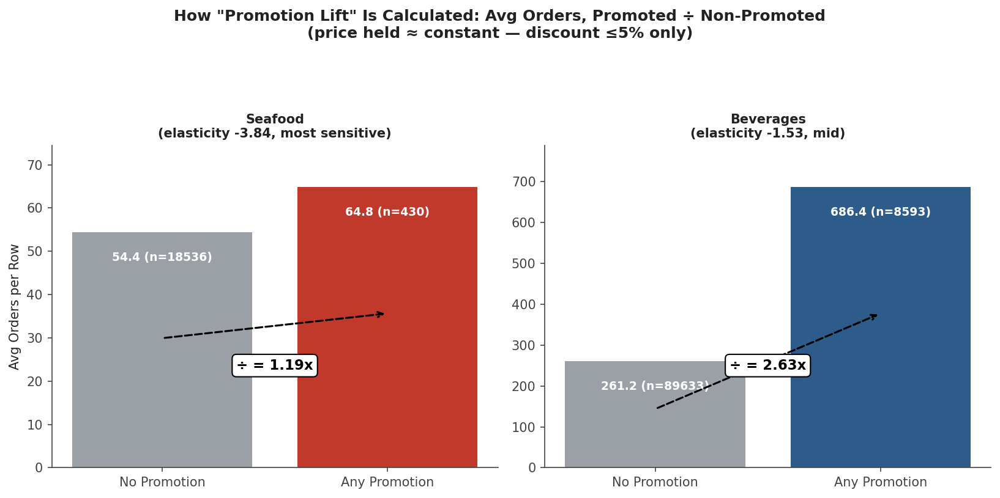

### 3.2 Elasticity vs. Promo Lift Across Categories

For each category: split the price-controlled rows into promoted vs. non-promoted, take the average order count in each group, divide. Seafood barely moves (1.19x) despite being the most price-elastic category in the data; Beverages moves far more (2.63x) from a much more moderate elasticity. Repeating this same calculation across all 14 categories produces the 14 points below.

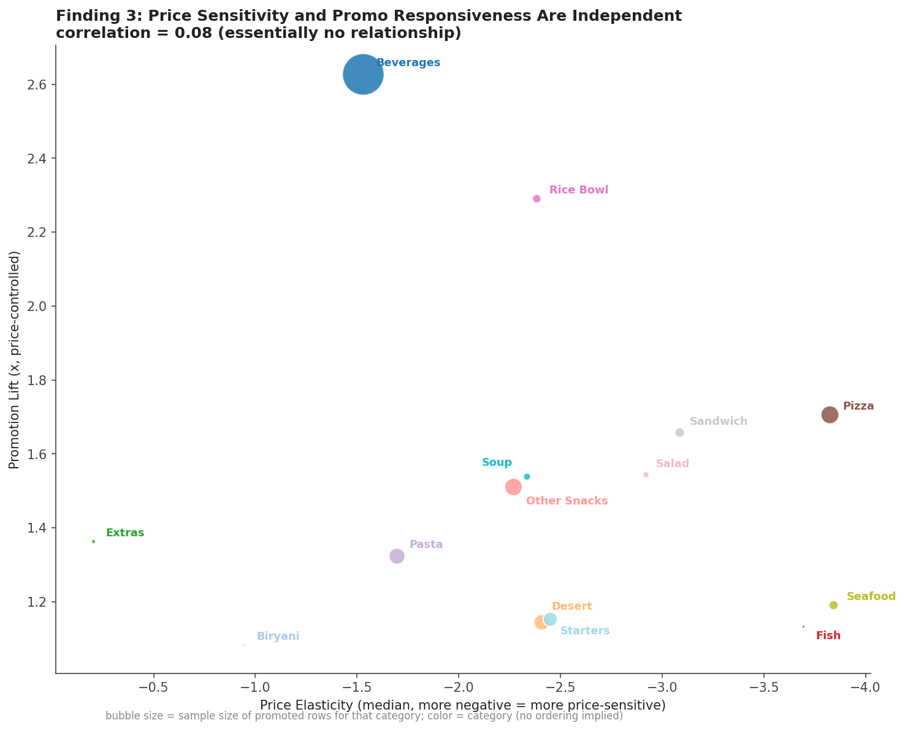

The correlation is 0.08 — no meaningful relationship. Seafood sits at the far right (elasticity -3.84, the most price-sensitive category in the data) but near the bottom (1.19x lift, one of the weakest promo responses). Beverages sits in the middle of the elasticity range (-1.53) but at the top of the chart (2.63x lift, the strongest promo response of any category). If elasticity predicted promo responsiveness, these two categories should have swapped positions — they didn't.

**What this means concretely:** you cannot use a category's price elasticity as a shortcut for guessing how it'll respond to promotion, or vice versa. A category that's a strong candidate for discounting (like Seafood) is not automatically a strong candidate for promotional spend, and a category worth promoting heavily (like Beverages or Rice Bowl) isn't automatically a good discounting target. These need to be evaluated as two separate decisions per category, each with its own data — which is exactly what the Recommendations matrix below does, treating elasticity and promo-lift as two independent axes rather than one.

**This is a finding that didn't confirm a hypothesis it could easily have confirmed, and it's reported that way** — it would have been a tidier, more satisfying story if the two lined up, and they simply don't.

*Caveat:* a few categories (Fish, Biryani) have small promoted-row samples (35-42 rows), so their specific lift numbers are noisier than categories with thousands of promoted rows — visible in the chart as the smallest bubbles.

---

## Finding 4: Category Averages Can Hide Product-Level Divergence Wide Enough to Mislead Pricing Decisions

This finding follows one logical chain across four charts: **(1) is the category average even trustworthy → (2) for the categories where it isn't, why do the products inside disagree → (3) is the company's current pricing actually accounting for that disagreement → (4) how much does getting this wrong actually cost.** Each step below is answered by the chart directly under it.

### 4.1 Is the Category Average Trustworthy?

Before trusting a category-level elasticity number, we checked whether the individual products inside each category actually agree with each other.

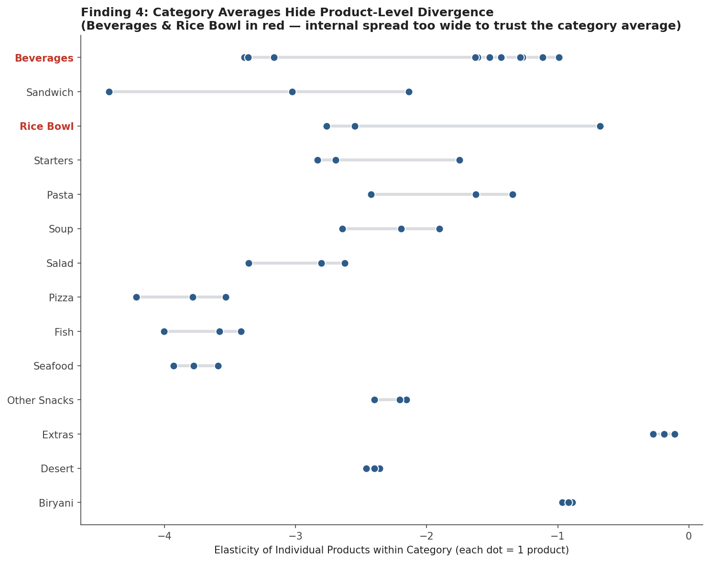

Most categories pass this check — the 3 products inside Seafood, Pizza, Extras, and Biryani all sit within a narrow band of each other (ranges of 0.08–0.68). For these, the category average is a trustworthy summary and Finding 1's category-level recommendations apply directly.

**Beverages and Rice Bowl fail this check**, and by a wide margin:
- **Beverages** (12 products): elasticity spans -3.39 to -0.99, a range of 2.40 — nearly the entire spread of the nine categories in between highest and lowest.
- **Rice Bowl** (3 products): two products sit around -2.6, one sits at -0.68.

For these two, a single category-level number would be actively misleading — so we dig into each separately below.

### 4.2 Why Do the Products Disagree?

Starting with Beverages, since it has enough products (12) to look for a pattern:

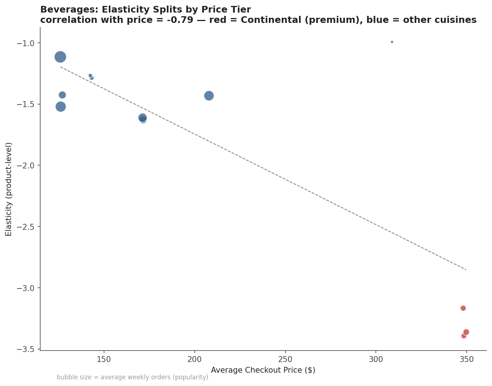

Elasticity correlates with price at -0.79 — a real, checkable cause. The three most elastic beverages are all Continental-cuisine, averaging $348 — a premium tier with close, cheaper substitutes nearby (Thai/Italian beverages at $125-210, mostly inelastic). Premium/discretionary items are easier to substitute away from when price rises, which is a coherent economic story, not just a coincidence. (One product, meal 2139 at $309, doesn't fit and is reported as an honest exception.)

Rice Bowl only has 3 products, too few to find a pattern in — and indeed, price doesn't explain it there (the low-elasticity product and one high-elasticity product have nearly identical prices, and all three share the same cuisine). That gap is picked back up in Step 3.

### 4.3 Does Current Pricing Account for This?

This is the step that turns "products disagree" into an actual business problem: is the company already pricing around this divergence, or is it invisible to current policy?

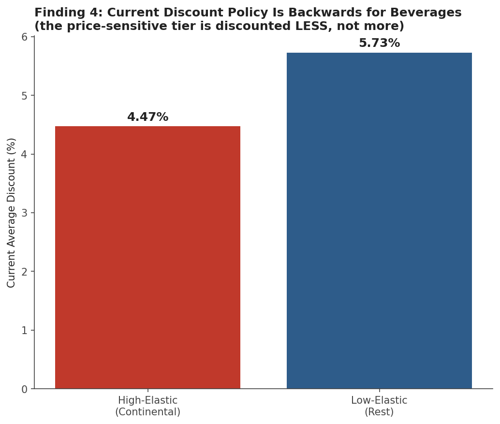

For Beverages: no. The price-sensitive Continental tier currently receives a *smaller* average discount (4.47%) than the price-insensitive tier (5.73%) — backwards from what Finding 1's logic recommends.

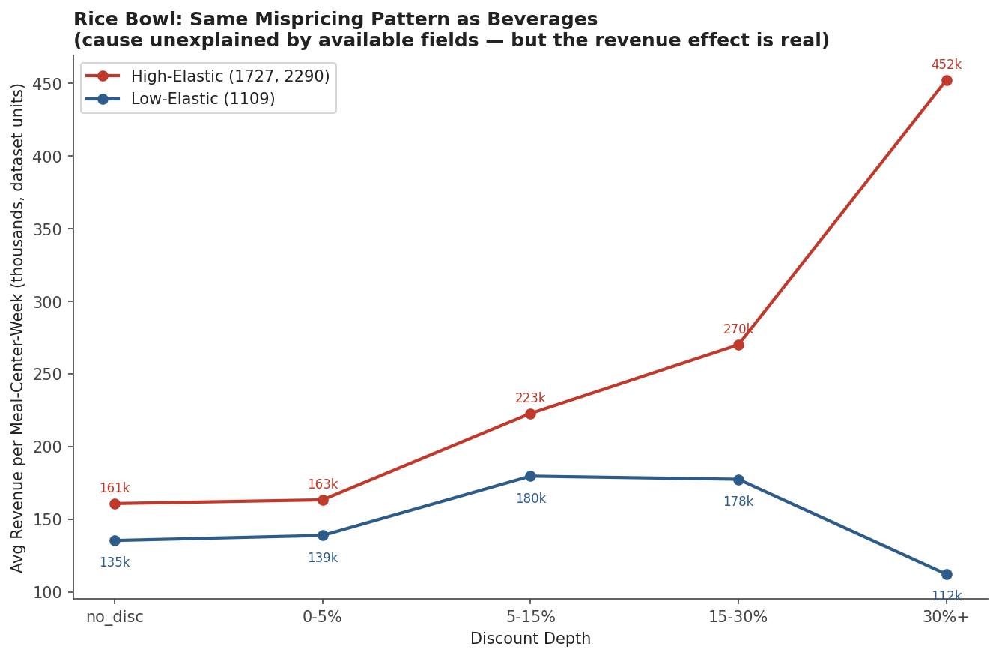

For Rice Bowl: same backwards pattern, even without an explainable cause. Meal 1109 (the low-elasticity outlier) currently carries the deepest average discount of the three (11.0%, vs. 4.35% for the other two) — and its revenue falls 17% as that discount deepens ($135k→$112k), while the other two gain 2.8x from the same discount depth. **The point of showing this alongside Beverages: you don't need to know *why* a product behaves differently to see that it's being priced wrong** — the mismatch is verifiable either way, which is why "cause unknown" doesn't block "action known."

### 4.4 How Much Is This Worth Fixing?

For Beverages specifically (where we can actually estimate a range): the revenue difference between current discount allocation and a naive "match the best-observed bucket" allocation is on the order of several hundred million to low billions in this dataset's units — roughly 20-30% of category revenue. This is a rough, static extrapolation (assumes no diminishing returns at scale, no fulfilment capacity limits, and uses revenue not profit), not a forecast — it should be read only as "large enough to prioritize," not as a number for a business case. That's exactly why the A/B test proposal exists: to replace this static estimate with a real, causal answer.

**Putting the four steps together:** the category-average trustworthiness check (Step 1) isn't just a data-quality footnote — it's what determines whether Finding 1's category-level playbook can be applied as-is (12 of 14 categories) or needs to be overridden at the product level (Beverages, and likely Rice Bowl once more data attributes become available). Steps 2-4 show that this isn't a hypothetical distinction: it's already costing real revenue through a backwards discount policy, at a scale worth fixing before it's worth precisely quantifying.

---

## Recommendations

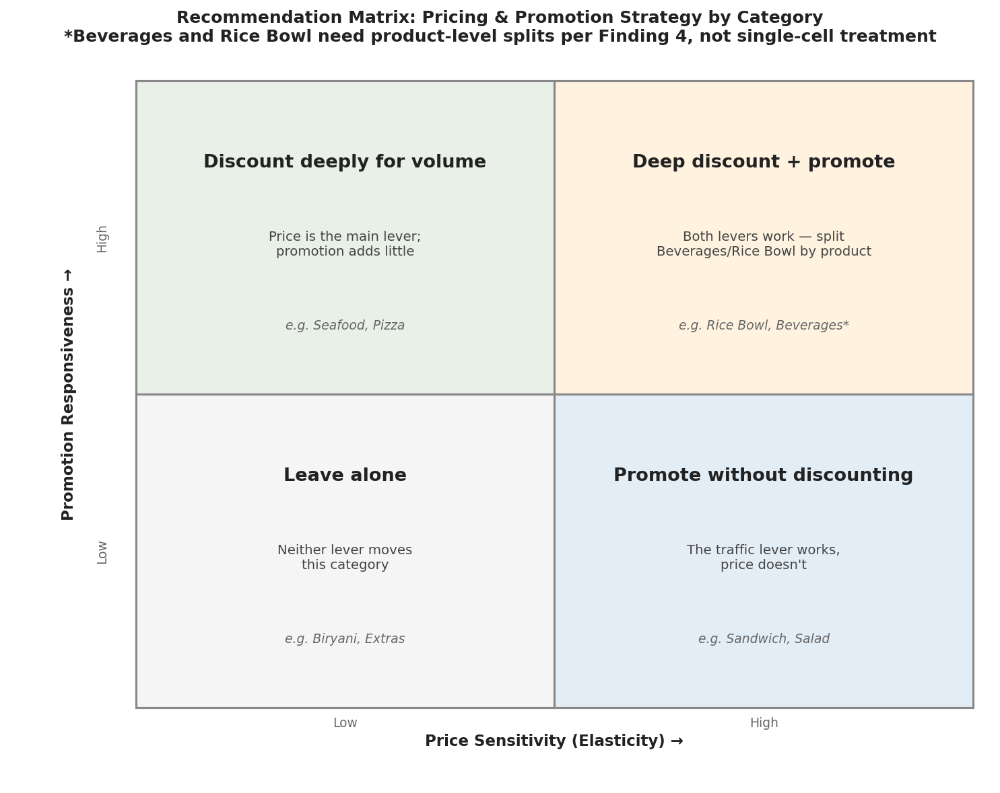

| | High price sensitivity | Low price sensitivity |
|---|---|---|
| **High promo responsiveness** | Deep discount + promote (e.g. Rice Bowl, Beverages*) | Promote without discounting — the traffic lever works, price doesn't |
| **Low promo responsiveness** | Discount deeply for volume — price is the main lever, promotion adds little (e.g. Seafood, Pizza) | Leave alone — neither lever moves this category (e.g. Biryani, Extras) |

*Beverages and Rice Bowl should be split at the product level per Finding 4, not treated as single category cells.

Specific, provable actions:
1. **Reduce Extras/Biryani discount depth** — Finding 1 shows discounting these categories loses revenue, not gains it.
2. **Reallocate promo budget toward homepage over emailer** when a choice must be made — Finding 2 shows it's the stronger single channel; don't assume stacking both scales linearly.
3. **Swap the Beverages discount allocation** — shift discount weight from the low-elastic tier onto the Continental (high-elastic) tier. Provable direction; exact magnitude needs the test below.
4. **Flag Rice Bowl meal 1109 for review** — it's being discounted the most while responding the least; the cause is unknown but the mispricing is not.

---

## Proposed A/B Test (Design Only — Not Yet Run)

Static analysis above shows *correlation* between discount depth and revenue outcomes across different products/weeks — not a controlled, causal test on the same product. Before implementing Recommendation #3 at scale, it should be validated with a randomized test.

**Objective:** Confirm that shifting discount depth from the low-elastic Beverages tier to the high-elastic (Continental) tier increases total Beverages revenue, without assuming the static extrapolation above is exact.

**Design:**
- **Unit of randomization:** fulfilment center (77 available) — not individual orders, since price changes apply center-wide and randomizing at the order level isn't operationally realistic.
- **Treatment:** Continental beverages discounted to 20-25% (currently ~4.5%); the 9 low-elastic beverages moved to 0% discount (currently ~2.5-16%).
- **Control:** current pricing continues unchanged.
- **Primary metric:** total Beverages revenue per center per week.
- **Sample size:** we pulled the real weekly per-center Beverages revenue from this dataset and measured its variance directly — it's noisier than a first guess would suggest (coefficient of variation = 58.9%, i.e. weekly revenue per center swings by more than half its own mean). At that variance, detecting a 15% revenue change in a single week of data would need ~242 centers per arm — more than three times the entire fleet of 77. Averaging revenue over multiple weeks reduces this noise (variance shrinks roughly with the square root of test duration), which is why test duration matters as much as center count here:

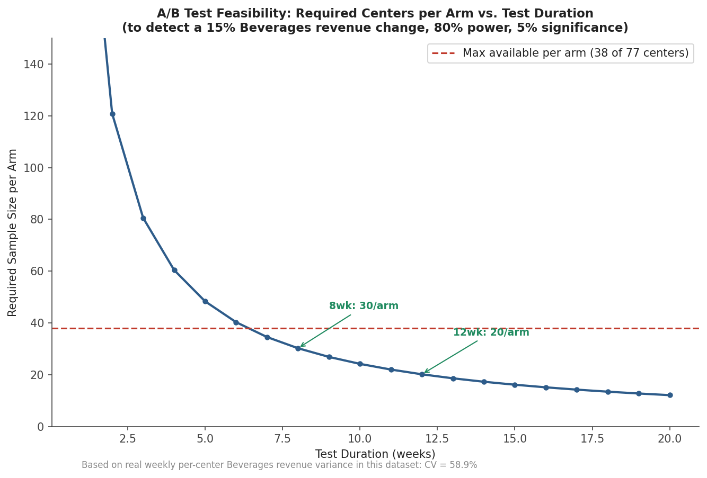

  At 8 weeks, ~30 centers per arm are needed — feasible within the 38-per-arm ceiling (half of 77). At 12 weeks, only ~20 per arm are needed, giving real margin for centers that drop out or have missing weeks. This is why the test should run at least 8 weeks, and 12 is safer.
- **Guardrail metric:** total order volume (make sure revenue gains aren't coming from a small number of large orders that would strain fulfilment capacity).

This section is a proposed methodology, explicitly not an executed experiment — it exists to show how the static findings above would be tested causally, not to claim the result is already known.

---

## Limitations

- **Revenue, not profit.** No cost/COGS data exists in this dataset. Every revenue-positive claim above could still be margin-negative; this report makes no profitability claims.
- **Observational, not causal**, except where explicitly marked as a proposed test. The promo and discount effects are real correlations in real data, controlled for confounders we could check (price level, center type, time), but not a randomized experiment.
- **Small-sample categories/combinations** are flagged inline (Fish, Biryani promo samples; the "both channels" combo group) — directionally trustworthy, not precise.
- **Rice Bowl's product-level divergence has no identified cause** given the fields available (category, cuisine, price). This is stated rather than papered over.
- **Region-level analysis was attempted and abandoned**: 4 of 8 regions have only 1 fulfilment center each — meaning "region effect" would really just be "individual center effect," not a reliable basis for a finding, so it isn't included above.

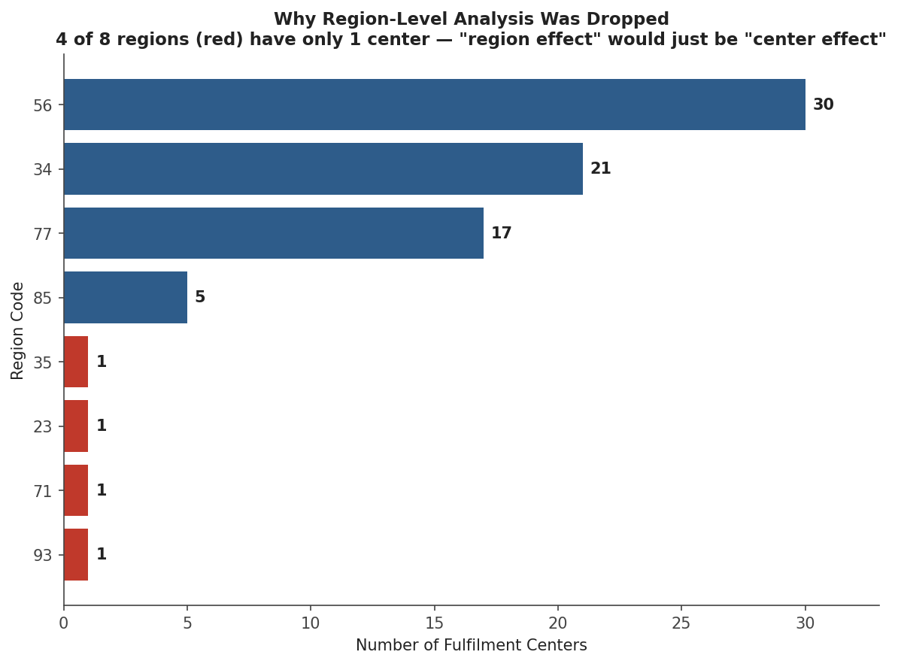
- **The order-of-magnitude revenue figure in Finding 4** is a rough static extrapolation, not a forecast — explicitly caveated where it appears.

---

## Data & Methodology

- **Source:** Genpact meal-delivery demand dataset (real company, anonymized), originally released for a demand-forecasting competition; repurposed here for pricing/promotion analysis.
- **Tables used:** `train.csv` (456,548 rows), `meal_info.csv` (51 meals × category/cuisine), `fulfilment_center_info.csv` (77 centers × type/region/size). Full field-by-field definitions: [`data_dictionary.md`](data_dictionary.md).
- **Tools:** Python (pandas, numpy, matplotlib), SQL.
- **Elasticity method:** log-log OLS slope of `checkout_price` vs. `num_orders`, estimated per meal×center pair with ≥10 distinct price points and ≥20 observations (3,534 of 3,597 pairs qualified). Full technical detail, including the A/B sample-size formula and a suggested robustness extension: [`methodology_appendix.md`](methodology_appendix.md).
- **SQL:** every aggregation behind the charts above, written and tested against the raw tables: [`sql/analysis_queries.sql`](sql/analysis_queries.sql).
- **All charts and tables in this report were generated directly from this dataset — no figures were estimated or invented.**
